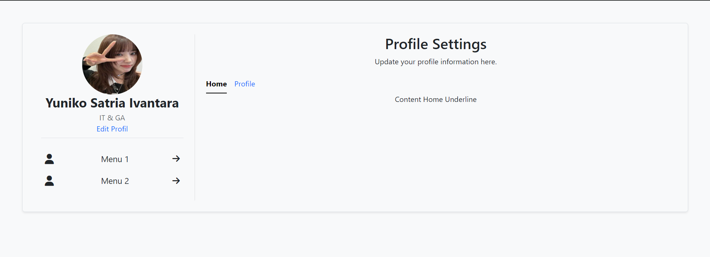

---

# My Profil Page

This project demonstrates a simple profile page template using HTML, Bootstrap, and JavaScript. It includes a responsive layout with collapsible submenus and tabbed content.

## Features

- **Profile Information**: Displays user profile picture, name, and role.
- **Menu Navigation**: Provides collapsible menus with submenu items.
- **Tabbed Content**: Allows switching between different sections using tabs.
- **Interactive Elements**: Uses JavaScript for submenu toggling and content display.

## Preview

---
